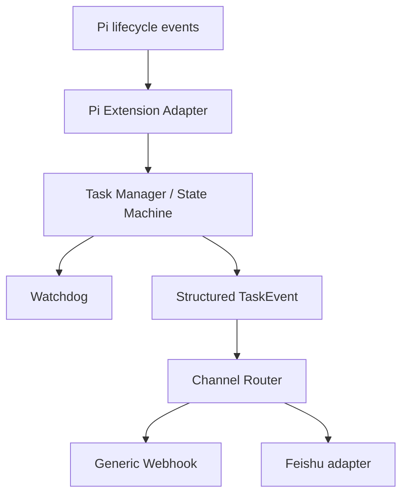

# Pi Pulse

Task monitoring, watchdogs and pluggable notifications for Pi Agent.

Pi Agent 的任务状态观察、Watchdog 与可插拔通知层。

> **Development preview / not released yet**

## Why

Pi Agent 的任务可能运行很久，但用户不应该一直守着终端窗口。Pi Pulse 在任务启动、长时间运行、疑似停滞和结束等关键状态变化时，主动向已配置的 outbound channel 发送结构化通知。

- 长任务运行时不需要一直守着终端
- 在关键状态变化时主动通知
- 通知渠道可插拔，Core 不绑定任何 IM
- 不要求部署服务器或常驻额外服务

## Architecture

Pi Pulse 是一个项目，但代码按职责拆分为 Core、Pi Extension Adapter、State Machine、Watchdog、Channel Router 和 outbound adapters。



Core 只产生结构化 `TaskEvent`，不生成飞书文本，也不 import 任何具体 channel。详见 [docs/ARCHITECTURE.md](docs/ARCHITECTURE.md)。

## Core Features

- 单一的 in-memory task state machine，支持多 session 隔离
- `TASK_STARTED`、`TASK_WARNING`、`TASK_STALLED`、`TASK_COMPLETED`、`TASK_FAILED`、`TASK_ABORTED` 领域事件契约
- 可注入 `Clock` 的 Watchdog，支持短阈值测试和 timer cleanup
- Channel failure isolation：一个 channel 失败不会影响其他 channel 或 Pi runtime
- 默认不发送完整 prompt、tool args、源码或环境变量
- Extension 只观察 Pi，不会 stop、kill 或 abort Pi 任务

## Supported Channels

- **Generic Webhook**：已实现最小 JSON `HTTP POST` outbound adapter，是架构上的一等公民。
- **Feishu**：已实现最小 outbound text adapter、renderer 和 transport 边界；本轮不包含 inbound bot。

所有 channel 都可以关闭；0 个 channel 时 Pi Pulse 仍可正常观察任务，Pi Agent 也不会被通知逻辑阻断。

## Quick Start

本项目当前尚未发布可安装版本。开发验证可以使用：

```text
npm ci
npm run typecheck
npm run lint
npm test
npm run build
```

开发配置模型见 [`examples/pi-pulse.json`](examples/pi-pulse.json)。将其内容按需放到 Pi Agent 配置目录中的 `pi-pulse.json`，并将 URL 保持为你自己的值，例如 `YOUR_WEBHOOK_URL`。

当前 Extension 默认读取 `~/.pi/agent/pi-pulse.json`。构建后可以在本地使用 `dist/extension/pi.js` 进行 Pi Extension 开发验证；这不是正式发布安装命令。

## Security / Privacy

- 仓库只包含 `YOUR_WEBHOOK_URL` 占位符，不包含真实 webhook、token、cookie 或凭据。
- 通知 payload 是结构化且有长度上限的领域事件；完整 prompt、完整 tool args、源码和环境变量不会进入事件。
- `workdir` 默认关闭，可通过配置显式开启；summary 会做裁剪和敏感信息过滤。
- Generic Webhook 要求 HTTP(S)，拒绝 URL credentials 以及常见 localhost、`.local`、`.internal` 和字面私网 IPv4 目标。
- 通知错误只产生不含 URL/body 的 warning，不会把 secret 写入日志。
- 出站通知是单次请求，没有 retry queue、persistent queue 或 dead letter queue。

## Non-goals for v0.1

- Control Plane
- Web Dashboard
- remote query
- multi-host aggregation
- remote control
- inbound IM Bot
- Agent 调度、kill、stop、abort
- AI 自动摘要、动态插件市场和 plugin manifest marketplace
- SQLite / PostgreSQL

## Roadmap

### v0.1

Observer + Watchdog + Outbound Channels

### Later

- Local Registry
- Optional Control Plane
- Interactive Channels
- Dashboard

不会在本 README 中承诺具体版本日期。

## Development Notes

本仓库的开发约束见 [AGENTS.md](AGENTS.md)。本轮属于工程基线，不代表完整 v0.1 产品已经完成。
