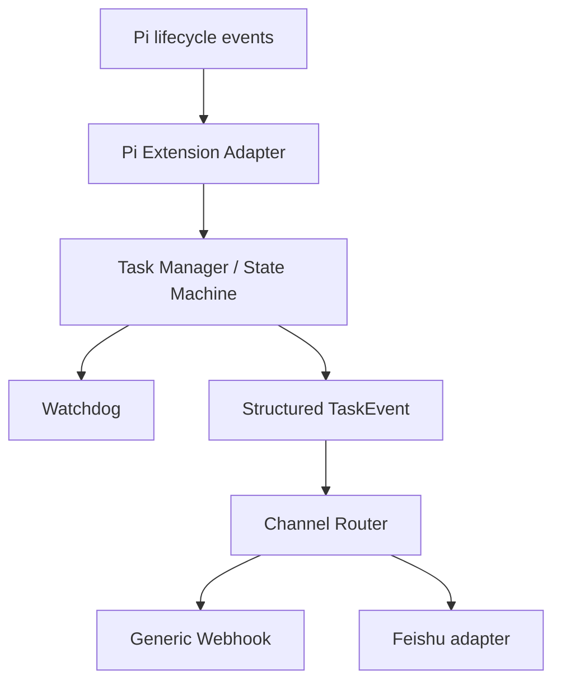

# Pi Agent Pulse

Pi Agent 的任务状态与 Watchdog 通知插件，让长任务运行时不必一直守着终端。

任务开始、长时间运行、疑似停滞和生命周期结束时，可主动通知到 Feishu 或 Generic Webhook。

[](https://www.npmjs.com/package/pi-agent-pulse)
[](https://github.com/0verme/pi-agent-pulse/actions/workflows/ci.yml)
[](LICENSE)

## 为什么需要 Pi Agent Pulse

Pi Agent 的长任务可能运行较久；Pi Agent Pulse 会在关键 lifecycle 和 Watchdog 状态发生时主动通知，让你不必一直守着 Pi 终端。

它不需要额外的 Dashboard、数据库、Web Server 或常驻服务。当前定位是 **Pi Agent Extension**，只 OBSERVE，不 stop、kill 或 abort Pi task。

## Quick Start

### 1. 安装

在已安装 Pi Agent 的环境中运行：

```bash
pi install npm:pi-agent-pulse
```

这是推荐的 npm 安装路径。

<details>
<summary>可选：从 GitHub 源码安装</summary>

```bash
pi install git:github.com/0verme/pi-agent-pulse
```

GitHub package installer 会 clone 仓库并执行 production `npm install --omit=dev`；它不会替 package 运行 `npm run build`，因此仓库中已提交 release `dist/` artifact。首次安装通常不需要手动构建。

</details>

### 2. 最小配置

先在 Feishu 群中创建自定义机器人并复制 webhook URL，然后创建配置文件：

Windows：

```text
%USERPROFILE%\.pi\agent\pi-pulse.json
```

Linux/macOS：

```text
~/.pi/agent/pi-pulse.json
```

写入最小 Feishu 配置：

```json
{
	"channels": {
		"feishu": {
			"enabled": true,
			"webhook": "YOUR_FEISHU_WEBHOOK_URL"
		}
	}
}
```

#### 也可以让 Agent 自动配置

如果 `pi-agent-pulse` 已经安装完成，可以直接把飞书 Webhook 交给当前机器上的可信本地 Agent，让它自动确认 Pi / Pi Web 的运行用户、HOME、配置路径并完成重启和验证。

```text
帮我配置 pi-agent-pulse 的飞书通知。

飞书 Webhook：
<YOUR_FEISHU_WEBHOOK_URL>

要求：
- 自动确认 Pi / Pi Web 实际运行用户和 HOME
- 配置正确的 ~/.pi/agent/pi-pulse.json
- locale 使用 zh-CN
- displayTimezone 使用 Asia/Shanghai
- 保留已有配置，不覆盖其他设置
- Webhook 按 secret 处理，不回显、不写入 Git 或日志
- 配置文件权限设为 600
- 按当前运行方式安全重启 Pi / Pi Web
- 确认 pi-agent-pulse 重新 Loaded
- 执行一次 smoke test
- 最后只汇报配置路径、重启结果和测试结果，不输出完整 Webhook
```

> Webhook 属于敏感凭证，请只提供给可信的本地 Agent，不要提交到 Git。

不要把真实 webhook URL 提交到 Git。

### 3. 重启 Pi 并验证

安装或修改配置后，重新启动 Pi / Pi Web，使 extension 重新加载。在 Pi 中运行：

```text
请回复一句“Pi Agent Pulse smoke test passed”，然后结束任务。
```

Feishu 中应看到类似的开始和结束通知：

```text
[Pi Pulse] 任务开始
[Pi Pulse] 任务完成
```

这里的“任务完成”对应 `TASK_COMPLETED` 且 `metadata.outcome=settled`，表示 Pi lifecycle 已 settled，不表示业务操作一定成功；详见 [Lifecycle Semantics](#lifecycle-semantics)。

## Features

- Task lifecycle notifications
- Long-task notice / warning / critical
- Long-tool detection
- Possibly-stalled detection
- Feishu notifications
- Generic Webhook
- `zh-CN` / `en-US` / `auto` locale
- system local timezone + configurable `displayTimezone`
- Privacy controls
- **OBSERVE ONLY**：不控制 Pi task

## Requirements / Compatibility

Pi Agent Pulse 是 **Pi Agent Extension**，需要运行在兼容的 Pi Agent 环境中；当前没有脱离 Pi 独立使用的产品目标。

- **支持范围（package metadata）**：`@earendil-works/pi-coding-agent >=0.84.4 <0.86.0`
- **Node.js**：`>=22.19.0`
- **自动化测试**：仓库 CI 在 Ubuntu 上使用 Node `22.19.0`，并通过 development dependency 使用 Pi `0.84.4`；CI 会运行 typecheck、lint、format check、unit tests、deterministic build check 和 package smoke。
- **实际 runtime 核对**：已在本机核对 Pi `0.84.4` 的实际 runtime types，并对照可获得的 `0.85.1` 相关 lifecycle types；这不等同于对所有 Pi runtime 场景都完成 fully verified 的真实运行验证。

## Configuration

配置文件路径见 [Quick Start](#quick-start)。Quick Start 中的 JSON 已经是可工作的最小 Feishu 配置；未填写的字段使用以下默认值。

| Config                             |                    Default | Meaning                                                                       |
| ---------------------------------- | -------------------------: | ----------------------------------------------------------------------------- |
| `locale`                           |                     `auto` | 通知语言；自动检测中文/英文，无法判断时使用 system locale，最后回退到 `en-US` |
| `displayTimezone`                  |     未设置（system local） | Feishu 人类可读时间的 IANA timezone；不改变 canonical UTC timestamp           |
| `hostname`                         | 未设置（runtime hostname） | `includeHost=true` 时使用的主机名，也可手动覆盖                               |
| `channels.feishu.enabled`          |                    `false` | 是否启用 Feishu                                                               |
| `channels.feishu.webhook`          |                       `""` | Feishu webhook URL                                                            |
| `channels.feishu.timeoutMs`        |                   `10,000` | Feishu 单次请求 timeout，范围会限制在 `100`–`120,000` ms                      |
| `channels.webhook.enabled`         |                    `false` | 是否启用 Generic Webhook                                                      |
| `channels.webhook.url`             |                       `""` | Generic Webhook URL                                                           |
| `channels.webhook.timeoutMs`       |                   `10,000` | Generic Webhook 单次请求 timeout，范围会限制在 `100`–`120,000` ms             |
| `watchdog.longTaskNoticeMinutes`   |                       `45` | 长任务 notice threshold                                                       |
| `watchdog.longTaskWarningMinutes`  |                       `75` | 长任务 warning threshold                                                      |
| `watchdog.longTaskCriticalMinutes` |                      `120` | 长任务 critical threshold                                                     |
| `watchdog.longToolMinutes`         |                       `20` | 单个 tool execution 的 long-tool threshold                                    |
| `watchdog.stalledMinutes`          |                       `15` | 无 Pi activity 时的 possibly-stalled threshold                                |
| `privacy.includeHost`              |                     `true` | 是否在事件中包含 host                                                         |
| `privacy.includeWorkdir`           |                    `false` | 是否在事件中包含 working directory                                            |
| `privacy.includeSummary`           |                     `true` | 是否包含经过清洗和截断的用户输入或模型输出 summary                            |

配置文件缺失、JSON malformed 或字段类型不符合预期时，会安全回退到默认配置；两个 channel 彼此独立。

### Locale、timezone 与 Watchdog

`locale` 支持 `auto`、`zh-CN` 和 `en-US`。`auto` 会在 adapter 内存中读取当前 Task 的用户输入或 prompt 来判断语言；无法判断时使用 Node/Intl 的 system locale，最后回退到 `en-US`。同一个 Task 的 started、Watchdog 和 completed/failed/aborted 通知会保持同一语言；Core `TaskEvent` 和 Generic Webhook 的 machine values 不会被翻译。

`displayTimezone` 使用 IANA timezone，例如 `Asia/Shanghai`、`Asia/Tokyo`、`America/New_York` 或 `UTC`。它只影响 Feishu 的 human-readable renderer；Generic Webhook 仍发送 ISO UTC payload。非法值会回退到 system local，并产生一次 bounded warning。

Watchdog threshold 的单位是分钟。长任务达到 notice、warning 或 critical threshold 时发送 `TASK_WARNING`；单个 tool 超过 `longToolMinutes` 时发送 long-tool warning；超过 `stalledMinutes` 未观察到 Pi activity 时发送 `TASK_STALLED`。

`hostname` 只用于覆盖默认的 runtime hostname。`timeoutMs` 适用于两个 outbound channel；请求有 timeout，不做无限 retry。

Feishu webhook 只接受以下官方 API 前缀：`https://open.feishu.cn/open-apis/` 或 `https://open.larksuite.com/open-apis/`。

## Privacy & Security

- Pi Agent Pulse 只 OBSERVE，不调用 Pi 的 stop、kill、abort 或其他任务控制 API。
- `privacy.includeSummary` 默认是 `true`。默认通知会包含经过现有安全清洗和长度截断的任务摘要（来自用户输入或模型输出），以及任务状态、时间、耗时（完成事件）、允许的仓库/分支等上下文和 Watchdog 信息。
- 摘要仍受现有安全边界约束：敏感行（token、password、secret、credential、authorization、webhook、环境变量引用等）会替换为 `[redacted]`，并在 TaskManager 层限制为 240 字符。截断/清理不等于去除敏感性；接收端仍应被视为可信边界。
- 隐私敏感环境可将 `privacy.includeSummary` 显式设置为 `false`，关闭摘要，使通知回到不含用户输入或模型输出摘要的形态。
- `TaskEvent` schema 不包含 tool arguments、源码、完整 tool result 或环境变量；summary 是否出现由 `privacy.includeSummary` 控制。
- `privacy.includeWorkdir` 默认是 `false`；`auto` 语言识别只在 adapter 内存中读取输入，不额外写入事件或日志。
- 不在日志中输出 webhook URL、token、cookie、secret 或原始 payload；真实 webhook secret 也不应提交到 Git。
- Generic Webhook 会校验 HTTP(S)、credentials，以及显式提供的常见 localhost、private IPv4、private IPv6 和 IPv4-mapped IPv6 literal；transport 使用 timeout、`redirect: "error"` 和单次请求。这个 URL 校验只拒绝显式提供的本地/私网地址，不保证阻止域名解析后指向私网地址的情况，因此不是完整 SSRF 防护。
- channel failure 会被独立捕获并产生 bounded warning，不影响其他 channel 或 Pi runtime。

## Lifecycle Semantics

Pi adapter 只根据明确的 lifecycle evidence 发出事件：

| Pi evidence                   | TaskEvent                                        | 含义                                                                           |
| ----------------------------- | ------------------------------------------------ | ------------------------------------------------------------------------------ |
| `agent_start`                 | `TASK_STARTED`                                   | Pi task 开始观察                                                               |
| Watchdog threshold            | `TASK_WARNING`                                   | 长任务或 long-tool 达到对应 threshold                                          |
| Watchdog inactivity heuristic | `TASK_STALLED`                                   | 一段时间没有观察到 Pi activity                                                 |
| `agent_settled`               | `TASK_COMPLETED` + `metadata.outcome: "settled"` | Pi lifecycle 已没有待处理的 retry、compaction 或 follow-up；不表示业务操作成功 |

`TASK_COMPLETED` 中的 `metadata.outcome=settled` 表示 lifecycle settled，而不是业务成功、失败或 abort reason。`TASK_FAILED` / `TASK_ABORTED` 是保留的 domain outcomes；当前 Pi adapter 不会根据 assistant 文本、summary、prompt、tool 名称或 `session_shutdown` 猜测并发出它们。

## Generic Webhook

Generic Webhook 是 channel-neutral 的 outbound HTTP POST，发送结构化 `TaskEvent` JSON。配置示例：

```json
{
	"channels": {
		"webhook": {
			"enabled": true,
			"url": "https://hooks.example.com/pi-pulse"
		}
	}
}
```

Feishu 和 Generic Webhook 可以同时启用，也可以全部关闭。每个 channel 的发送失败都会被隔离，不改变 task state，也不会影响 Pi runtime。Generic Webhook 只提供 outbound transport，不提供 inbound bot、remote query 或 control API。

## Architecture

Core 只产生结构化 `TaskEvent`，不依赖具体 IM；消息格式和 HTTP transport 属于 adapter。代码数据流如下：



详细的依赖方向、state machine、watchdog、failure isolation 和隐私边界见 [docs/ARCHITECTURE.md](docs/ARCHITECTURE.md)。

## Development / Contributing

本仓库的开发和验证命令：

```bash
npm ci
npm run typecheck
npm run lint
npm run format:check
npm test
npm run build:check
npm run test:package
```

npm package 和 GitHub package 共用已提交的 `dist/` artifact；Git package installer 不自动 build。`npm pack` 的发布内容由 package smoke 检查；`npm run test:package` 不会向 Feishu 或任何真实 webhook 发送请求，而是在临时目录检查 tarball、安装 package 并 import extension。

当前明确不包含 Dashboard、Web UI、Control Plane、数据库、remote control、inbound bot 或更多 IM adapter。Pi Agent Pulse 的产品边界仍然是运行在 Pi Agent 内的任务观察、Watchdog 和 outbound notification。
