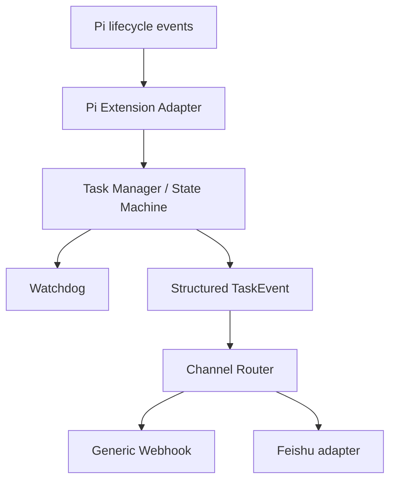

# Pi Pulse

Pi Agent 的任务状态观察、Watchdog 与可插拔 outbound notification layer。

> **v0.1.0**：首个公开可安装版本；当前版本只观察任务，不控制 Pi。

## What is it?

Pi Pulse 作为 Pi Agent Extension 运行，在任务启动、长时间运行、疑似停滞和生命周期结束时，向 Feishu 或 Generic Webhook 发送 bounded notification。

## Why do I need it?

长任务运行时，你不必一直守着 Pi 终端；关键状态会主动通知到已配置的 channel。Pi Pulse 不需要 Dashboard、数据库、Web Server 或常驻额外服务，也不会 stop、kill 或 abort Pi 任务。

## 5-Minute Quick Start

### 1. 安装

#### 推荐：npm 安装

```bash
pi install npm:pi-agent-pulse
```

#### GitHub / 源码安装

```bash
pi install git:github.com/0verme/pi-agent-pulse
```

两种安装方式都会把 package 写入 Pi 的用户 settings，并在 Pi 启动时自动加载 `package.json` 中的 extension manifest。npm 安装使用 npm registry 中的 package；GitHub 安装会 clone 仓库并执行 production `npm install --omit=dev`。Git package installer 不会替 package 运行 `npm run build`，因此 release `dist/` artifact 已作为 GitHub package 分发的一部分提交，陌生环境不需要先安装源码依赖或手动构建。

### 2. 创建 Feishu 群机器人

在要接收通知的 Feishu 群中：

1. 打开群设置，添加 **Bot / 群机器人**。
2. 选择自定义机器人并完成创建。
3. 复制机器人生成的 webhook URL。不要把真实 URL 提交到 Git。

### 3. 创建配置文件

Linux/macOS 配置路径：

```text
~/.pi/agent/pi-pulse.json
```

Windows 配置路径：

```text
%USERPROFILE%\.pi\agent\pi-pulse.json
```

写入最小 Feishu 配置即可，其余 watchdog、privacy、timeout 和 Generic Webhook 都会使用默认值：

```json
{
	"channels": {
		"feishu": {
			"enabled": true,
			"webhook": "YOUR_FEISHU_WEBHOOK_URL"
		}
	}
}
```

如果目录不存在，请先创建 `~/.pi/agent`（Windows 对应 `%USERPROFILE%\.pi\agent`）。配置文件只应保存在本机；示例中的 `YOUR_FEISHU_WEBHOOK_URL` 必须替换为你自己的 URL。

### 4. 启动 Pi

在任意 Pi project 中启动：

```bash
cd /path/to/your/project
pi
```

安装完成后重新启动 Pi；Extension 会通过 package manifest 自动加载，不需要修改源码，也不需要启动额外服务。

### 5. 验证通知

在 Pi 中执行一个简单任务，例如：

```text
请回复一句“Pi Pulse smoke test passed”，然后结束任务。
```

在 Feishu 群中应看到：

```text
[Pi Pulse] TASK_STARTED
[Pi Pulse] TASK_COMPLETED
```

这里的 `TASK_COMPLETED` 表示 Pi 已发出 `agent_settled`，即没有待处理的 retry、compaction 或 follow-up；它不承诺业务操作成功。channel 发送失败只会在 Pi 本地产生 bounded warning，不会阻断 Pi task。

## Observed Events and Channels

Pi Pulse 为每个 session 独立维护任务状态，并产生以下 bounded outbound notifications：

- `TASK_STARTED`：任务开始时发送，并记录 `startedAt`。
- `TASK_COMPLETED`：Pi 生命周期 settled 时发送，并带 `startedAt`、`endedAt` 和耗时；settled 不等同于业务成功。
- Long-task watchdog：任务达到 notice、warning 或 critical threshold 时发送 `TASK_WARNING`。
- Long-tool detection：单个 tool execution 超过 long-tool threshold 时发送 `TASK_WARNING`。
- Possibly stalled：超过 stalled threshold 未观察到 Pi activity 时发送 `TASK_STALLED`。

支持的 outbound channels：

- **Feishu**：发送 bounded text notification；只接受 `https://open.feishu.cn/open-apis/` 或 `https://open.larksuite.com/open-apis/` webhook。
- **Generic Webhook**：发送 channel-neutral `TaskEvent` JSON；只实现 outbound HTTP POST。

每个 channel 的失败都会被隔离并产生 bounded warning，不会影响其他 channel 或 Pi runtime。

Generic Webhook 示例：

```json
{
	"channels": {
		"webhook": {
			"enabled": true,
			"url": "https://hooks.example.com/pi-pulse"
		}
	}
}
```

两个 channel 可以同时启用，也可以全部关闭。配置文件缺失、JSON malformed 或字段缺失时，会安全回退到默认配置。

## Lifecycle Outcome Contract

当前已核对 Pi `0.84.4`（开发基线）和可获得的 `0.85.1` runtime types：`agent_settled` 只有“生命周期已 settled”信号，没有 success、failure 或 abort reason。因此 adapter 只使用明确的 Pi lifecycle evidence：

- `agent_start` → `TASK_STARTED`
- Watchdog threshold → `TASK_WARNING`
- Watchdog inactivity heuristic → `TASK_STALLED`
- `agent_settled` → `TASK_COMPLETED`，并带 `metadata.outcome: "settled"`
- `TASK_FAILED` / `TASK_ABORTED` 是保留的 domain outcomes；当前 Pi adapter 不会根据 assistant 文本、summary、prompt、tool 名称或 `session_shutdown` 猜测并发出它们。

## Security / Privacy

- Pi Pulse 只 OBSERVE，不调用 Pi 的 stop、kill、abort 或其他任务控制 API。
- 不发送完整 prompt、完整 tool args、源码、完整 tool result 或环境变量。
- summary 会裁剪并过滤敏感内容；`workdir` 默认关闭。
- 不在日志中输出 webhook URL、token、cookie、secret 或原始 payload。
- Generic Webhook 会校验 HTTP(S)、host、credentials 和常见 localhost / private network literal；transport 使用 timeout、`redirect: "error"` 和单次请求。
- channel failure 会被独立捕获，不影响其他 channel 或 Pi runtime。

## Architecture

Core 只产生结构化 `TaskEvent`，不依赖具体 IM；消息格式和 HTTP transport 属于 adapter。代码数据流如下：



详细的依赖方向、state machine、watchdog、failure isolation 和隐私边界见 [docs/ARCHITECTURE.md](docs/ARCHITECTURE.md)。

## Package Strategy

- npm package 是 v0.1.0 的推荐安装路径；GitHub Git package 继续作为源码安装方式。
- npm package 与 GitHub package 共用已提交的 `dist/` artifact；Git package installer 不自动 build。
- `npm pack` tarball 只包含 `dist/`、`package.json`、`README.md` 和 `LICENSE` 所需的发布内容，并由 `npm run test:package` 做临时安装与 extension import smoke。
- `@earendil-works/pi-coding-agent` 是 host-provided peer dependency，开发时固定使用 `0.84.4`；已验证兼容范围为 `>=0.84.4 <0.86.0`。

## Development and Release Checks

```bash
npm ci
npm run typecheck
npm run lint
npm run format:check
npm test
npm run build
npm run test:package
```

`npm run test:package` 不会向 Feishu 或任何真实 webhook 发送请求；它会运行 `npm pack`、检查 tarball 内容、在临时目录安装 package，并 import `dist/extension/pi.js` 验证 extension exports。

## Non-goals for v0.1

本轮明确不实现：

- Dashboard、Web UI、Control Plane
- SQLite、PostgreSQL、NAS aggregation 或 multi-host registry
- remote query、remote control、inbound Feishu bot
- Telegram、Slack、Discord、企业微信
- retry queue、persistent queue、dead letter queue
- AI summary、plugin marketplace
- Agent 调度、stop、kill、abort
