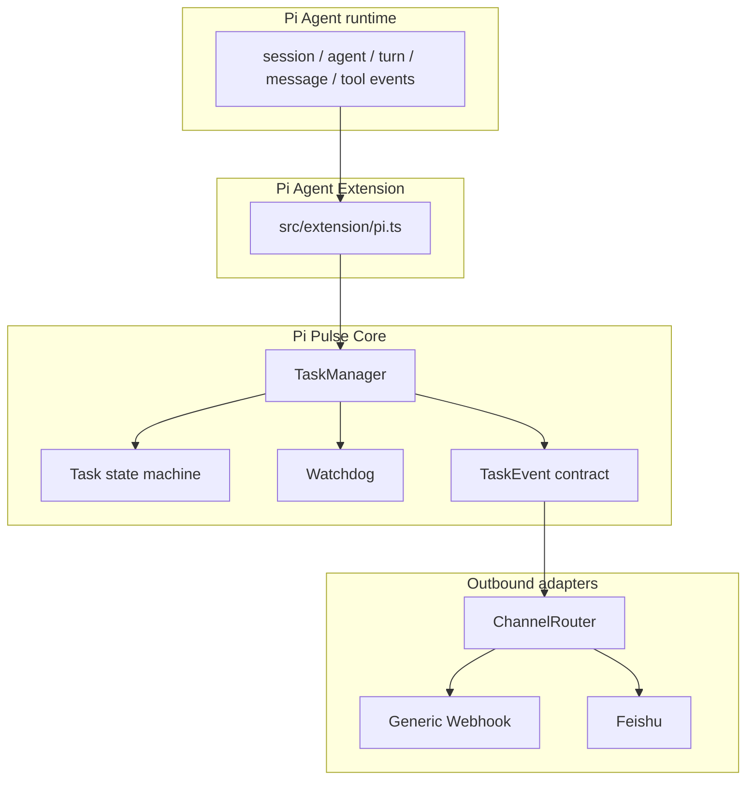

# Pi Pulse Architecture

Pi Pulse 是一个项目，代码内部按职责模块化，部署上以 Pi Agent Extension 为核心；未来可以附加 Optional Control Plane，但本轮不实现它。

## 1. 为什么不是两个 Pi Plugin

Pi Pulse 不把“观察状态”和“发送通知”拆成两个互相竞争的 Pi Plugin。单一 Extension Adapter 绑定一次 Pi lifecycle，并把事件交给同一份 Core State Machine。这样可以保证：

- 一个 session 只有一个 task lifecycle 和一组 watchdog timers
- retry、compaction、queued follow-up 不会被不同 plugin 重复解释
- notification dedup 有统一边界
- Core 和各 channel adapter 可以独立测试

“一个项目”是产品边界；`src/` 下的模块边界是代码职责边界。

## 2. 数据流



Core 的依赖方向是单向的：

```text
extension/pi.ts -> core/*
extension/pi.ts -> channels/*
extension/pi.ts -> config/*
core/*          -> core/* only
channels/*      -> core/events.ts + channels/types.ts
config/*        -> no concrete channel implementation
```

`core/*` 不允许 import `channels/feishu/*` 或 `channels/webhook/*`。未来新增 channel 时，应在 adapter 层实现 `OutboundChannel`，而不是修改 State Machine。

## 3. 为什么 State Machine 只有一份

`TaskManager` 是 Extension runtime 内的单一事实来源。它按 `sessionId` 保存一个 active task，并把 agent、tool 和 watchdog 观察归并到同一状态：

- `RUNNING`：Pi agent 正在运行，且当前没有 active tool
- `TOOL_RUNNING`：收到明确的 `tool_execution_start`，至少一个 tool 正在执行
- `POSSIBLY_STALLED`：Watchdog 根据一段时间没有 Pi activity 推断的状态
- `COMPLETED`：收到 `agent_settled`，表示本次 Pi agent lifecycle 已结束
- `FAILED`：由明确的 adapter/调用方失败信号驱动；当前 Pi adapter 尚未把它自动映射出来
- `ABORTED`：仅允许明确的调用方信号驱动；当前 Pi adapter 不会从 shutdown 或 timeout 猜测它
- `UNKNOWN`：事实不足时保留不确定性

terminal state 不允许回到运行态。新的 task lifecycle 会创建新的 task id，而不是复用旧 timers。

## 4. 为什么 Feishu 只是 adapter

Core 输出 `TaskEvent`，其中只有 channel-neutral 的字段：event type、task/session identity、state、时间、当前 tool、bounded summary、warnings 和 safe metadata。Core 不知道：

- 飞书的 `msg_type` / card / text 格式
- 任何 webhook host
- 飞书 token、签名或 inbound API

`src/channels/feishu/renderer.ts` 负责把领域事件转换为 bounded text，`transport.ts` 负责 Feishu-specific outbound HTTP contract。以后改变 Feishu 格式，不需要改 Core、TaskManager 或 Watchdog。

Generic Webhook 同样是一等公民：它直接发送 `TaskEvent` JSON，而不是把所有渠道都先转成飞书消息。

## 5. Outbound 与未来 Inbound 分离

本轮只有 `OutboundChannel.send(event)`。Outbound 是 Pi 状态变化后的单向通知，不接受远端指令，也不拥有 task control 权限。

未来的 inbound IM、remote query 或 interactive channel 必须使用独立的 command/query boundary，并经过明确的权限、认证和 session lookup。它们不能复用 outbound adapter 的 send 方法，也不能通过通知代码调用 `abort`、`shutdown`、`stop` 或 `kill`。

## 6. Control Plane 为什么是 optional

v0.1 的核心价值是“关键状态变化时主动通知”，Pi Extension 已足够完成这一点，不需要数据库、Web Server、Dashboard 或常驻 daemon。

未来 Control Plane 可以作为可选部署单元，为 Local Registry、多机聚合、历史查询或 Dashboard 提供能力；它不能成为 Core 的运行时前置依赖。Extension 在 Control Plane 不存在或不可用时仍应正常运行。

## 7. Watchdog 与 dedup

生产默认阈值来自经过验证的 prototype：

| Signal             | Default |
| ------------------ | ------: |
| long task notice   |  45 min |
| long task warning  |  75 min |
| long task critical | 120 min |
| long tool          |  20 min |
| possibly stalled   |  15 min |

`Watchdog` 只管理 in-memory timers，不进行网络 I/O。它支持注入 `Clock`，测试可以使用短阈值和 fake clock：

- 同一个 task id 的 `start()` 会先清理旧 registration，避免 duplicate timers
- 每个 long-task level 每个 task 只触发一次
- 每个 tool call 的 long-tool warning 只触发一次
- `recordActivity` 只重排 stalled timer，不重置 long-tool start clock
- `stop`、`stopAll` 和 `session_shutdown` 会清理 task/tool/stalled timers
- `ChannelRouter` 按 `eventId` 去重，并在 extension runtime 内保留有限数量的 event ids

## 8. Failure isolation

发送路径如下：

```text
TaskManager emits TaskEvent
        |
        v
ChannelRouter.dispatch()  -- does not await network I/O
        |
        +--> channel A Promise (caught independently)
        +--> channel B Promise (caught independently)
        +--> channel C Promise (caught independently)
```

任何 channel rejection 都会：

1. 被该 channel 自己的 Promise chain 捕获
2. 产生不含 URL、body 或原始 exception message 的 warning
3. 不影响其他 channel
4. 不向 Pi lifecycle handler 抛出

Generic Webhook 和 Feishu transport 都是单次请求，使用 timeout、`redirect: "error"`，不做无限 retry。通知失败不能改变 task state，也不能影响 Pi agent 正常运行。

## 9. Security / privacy boundary

领域事件是出站边界。默认策略：

- prompt 只允许作为短、经过过滤的 summary 候选，不发送完整 prompt
- tool args 不进入事件；只允许 bounded tool name
- 不发送源码、完整 tool result 或环境变量
- `workdir` 默认不包含；显式开启后仍裁剪长度
- metadata 只保留 string/number/boolean/null，并过滤敏感 key
- transport 从不打印 destination URL 或 JSON body
- Generic Webhook 在发送前校验 scheme、host、credentials 和常见本地/私网字面地址
- Feishu 只允许 `open.feishu.cn` / `open.larksuite.com` 的 HTTPS `/open-apis/` 路径

这不是完整的企业数据防泄露系统；使用者仍需把 endpoint 当作敏感配置管理，不要把配置文件提交到仓库。

## 10. 已验证与未验证的 Pi API 边界

本轮在本机实际 Pi `0.84.4` 的 `@earendil-works/pi-coding-agent` runtime type 上核对了：

- `ExtensionAPI.on(event, handler)`
- `session_start`、`session_shutdown`
- `input`、`before_agent_start`
- `agent_start`、`agent_end`、`agent_settled`
- `turn_start`、`turn_end`
- `message_start`、`message_update`、`message_end`
- `tool_execution_start`、`tool_execution_update`、`tool_execution_end`
- `ExtensionContext.cwd`
- `ExtensionContext.sessionManager.getSessionId()` 和 `getBranch()`
- `ExtensionAPI.exec(command, args, options)`，用于异步读取 git branch

Prototype 中已实际使用并在本项目 adapter 中按边界重用的行为：

- `before_agent_start` / `input` 识别新的用户驱动 task
- `agent_start` 建立 task lifecycle；没有新的 prompt 时保留 retry/continuation 的现有 task
- tool start/update/end 更新 activity 和当前 tool
- turn/message/agent end 更新 last activity 与 bounded final summary
- `agent_settled` 作为无 retry、无 compaction、无 queued follow-up 的 delivery boundary
- `session_shutdown` 清理 timers 和 in-memory state

以下部分目前不能由已核对的 lifecycle 类型可靠确定，因此 adapter 不伪造：

- `agent_settled` 没有 success/failure/cancel reason；当前 `TASK_COMPLETED` 表示 lifecycle settled，不等价于业务成功
- 当前所用 Pi events 没有一个明确的用户 cancel event；不能从 `session_shutdown` 推断 `TASK_ABORTED`
- 单个 tool 的 error 不等于整个 task failed；`TASK_FAILED` 保留给未来明确失败信号
- `POSSIBLY_STALLED` 是 Watchdog heuristic，不是 Pi 明确报告的卡死

修改 Pi lifecycle adapter 前，必须重新核对实际安装版本的 runtime type，不根据旧文档或印象添加 event。
